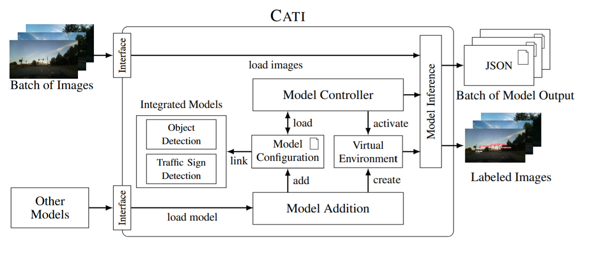
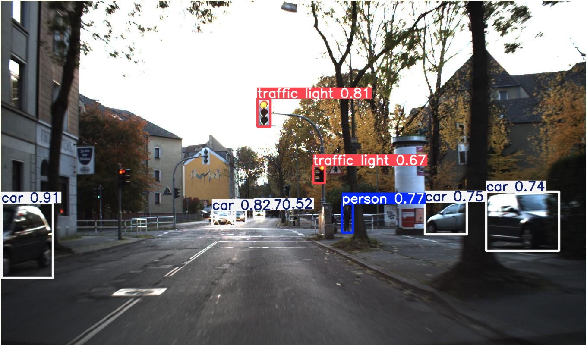
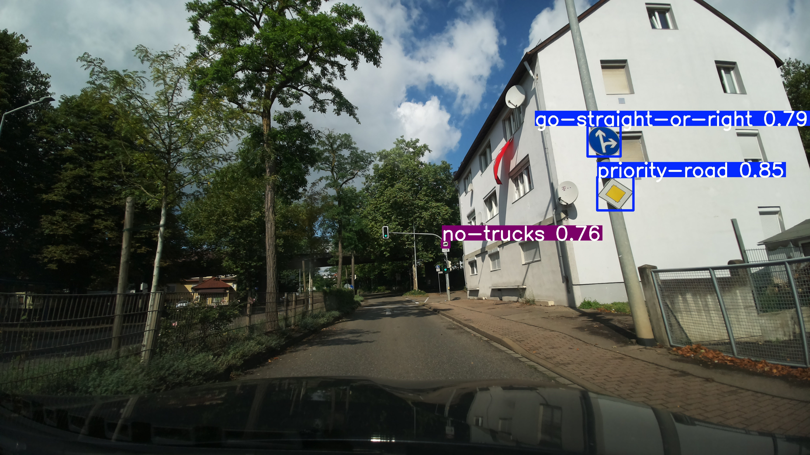

# CATI (Common Automotive Tasks on Images)

"CATI" is a tool to easily integrate and test deep learning automotive detection models. It is based on our paper "CATI – An Open-Source Framework to Evaluate Attacks on Cameras for Automated Vehicles".

Core features include:

- **Automotive Object Detection:** Specifically trained version of [YOLOv10](https://docs.ultralytics.com/models/yolov10/) for the task of automotive object detection. It was trained on the [COCO dataset](http://link.springer.com/10.1007/978-3-319-10602-1_48) with the following object types: "Person," "Car," "Bicycle," "Motorcycle," "Bus," "Truck," and "Traffic Light."
- **Traffic Sign Detection:** Specifically trained version of [YOLOv10](https://docs.ultralytics.com/models/yolov10/) for the task of traffic sign detection. It was trained on a subset of the [Mapillary Traffic Sign Dataset](https://link.springer.com/10.1007/978-3-030-58592-1_5) including [51 different German traffic signs](demo/traffic_sign_classes.png).
- **Modular Framework:** Its modular architecture allows the integration of further automotive machine learning models.



* [Requirements](#requirements)
* [Setup](#setup)
* [Use the integrated models](#usage--examples)

## Requirements
CATI itself is built using default Python libraries, but a conda installation is required to create environments and install requirements for the different models.

For the installation we refer to the original homepage: https://docs.anaconda.com/miniconda/install/
Tested with Miniconda versions 24.9.2, 24.7.1, and 24.3.0.

## Setup

1. Clone the repository
2. Install CATI with

```bash
python setup.py
```

This will create the needed environments and requirements for the two integrated models.

_Hint:_ If you have problems with conda, try running the steup in the "base" conda environment (`conda activate base`).

## Usage & Examples
General Syntax:

```plain
usage: cati.py [-h] --input INPUT --output OUTPUT --model
                    {yolov10_object_detection,yolov10_traffic_sign_detection}
                    [{yolov10_object_detection,yolov10_traffic_sign_detection} ...]
                    [--conf CONF] [--save_images] [--cuda]
```

List of parameters:
* `--input`: Filepath to the folder containing the images to analyze.
* `--output`: Filepyth to the folder that will contain the results (will be created if not existing).
* `--model`: Space-separated list of models to execute.
* (_Optional_) `--conf`: Confidence threshold value between 0.0 and 1.0. Default: 0.5
* (_Optional_) `--save_images`: If given, save the images that include the detected objects
* (_Optional_) `--cuda`: Use CUDA to execute the models. This requires a compatible hardware and driver.

### Examples:

1. Change the confidence cutoff value: 
```bash
python cati.py --input /test_images --output /test_output --model yolov10_object_detection --conf 0.4
```

2. Save the images with marked detections (flag):
```bash
python cati.py --input /test_images --output /test_output --model yolov10_object_detection --save_images
```

3. Use cuda for detection (flag):
```bash
python cati.py --input /test_images --output /test_output --model yolov10_object_detection --cuda
```

4. Run inference on multiple models:
```bash
python cati.py --input /test_images --output /test_output --model yolov10_object_detection yolov10_traffic_sign_detection
```

### Output of Automotive Object Detection


### Output of Traffic Sign Detection



### Output
By default the output will only contain a `json`-file for each image that will list all detected objects. There will be one sub-directory for each image in the output folder containing the images for each selected model (if enabled) and the `json`-file with all detected objects.


## Model Addition
General syntax:

```plain
model_addition.py [-h] --model_path MODEL_PATH --inference_path INFERENCE_PATH --weights_path WEIGHTS_PATH
                         --requirements_path REQUIREMENTS_PATH --python_version PYTHON_VERSION --name NAME
```

List of parameters:
* `--model_path`: Filepath to the trained custom model.
* `--inference_path`: Filepath to the python script that runs the inference of the custom model.
* `--weights_path`: Filepath to the trained model (typ. "PT" file).
* `--requirements_path`: List of Python requirements in the [requirements file format](https://pip.pypa.io/en/stable/reference/requirements-file-format/).
* `--python_version`: Specification of the exact Python version
* `--name`: Name of the model (avoid using spaces)

Example 
```bash
python model_addition.py --model_path /yolov10 --inference_path /yolov10/inference.py --weights_path pretrained_weights/yolov10m.pt --requirements_path yolov10_requirements.txt --python_version 3.10 --name yolov10_object_detection
```
Important to note is that the file for the `--inference_path` (the file that initalizes the model and will load in the images etc.) has to be inside the `--model_path` to ensure that the paths can be correctly set for the interface. 

After calling `model_addition.py`, all files should are moved to the respective directories, an environment with the necessary dependencies is created and the paths are configured such that `cati.py` includes the newly added model now in its selection.

Please also make sure that the `--inference_path` file, will accept all the parameters that can be used in `cati.py` to ensure correct functionality.


## Acknowledgements

Datasets: 
1. bdd100k (https://doc.bdd100k.com/)
2. German Traffic Sign Detection Benchmark (GTSDB) (https://benchmark.ini.rub.de/gtsdb_dataset.html)
3. Mappillary Traffic Sign Dataset (https://www.mapillary.com/dataset/trafficsign)
4. Common Objects in Context (COCO) (https://cocodataset.org/#home)

Models:
1. YOLOv10 (https://github.com/THU-MIG/yolov10)